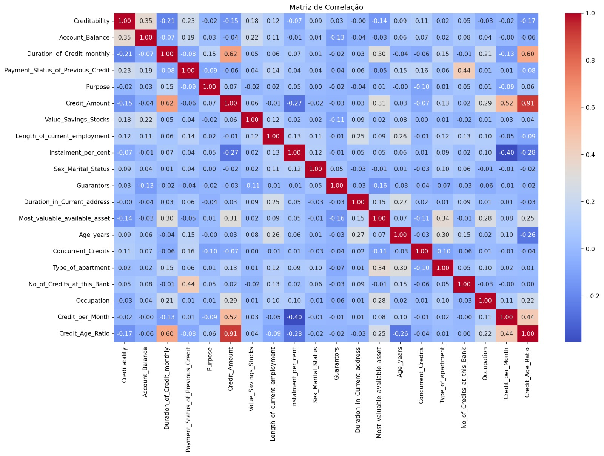

# Desenvolvimento de um Modelo Preditivo para Apoio à Decisão de Crédito com abordagem em *Machine Learning*

## Identificação da Equipa 
* **Grupo nº:** 5
* **Membros:** 
  * Iara Gomes - Nº 2023133177 
  * Rita Vinagreiro - Nº 2023136923 
  * Ana Silva - Nº 2023145191

* **Video final do projeto:**
  * https://drive.google.com/file/d/1amB4iFeMJi5ZeX5--rosHQ0BNnNoYGnX/view?usp=sharing
  
## Organização do Repositório 
 
A estrutura deste projeto segue as boas práticas de Ciência de Dados e Engenharia de Software: 
 
* **`data/`**: Armazenamento de dados (dados brutos em `raw/` e processados em `processed/`). 
* **`docs/`**: Documentação técnica detalhada dividida por Milestones (M1, M2, M3 e M4). 
* **`notebooks/`**: *Jupyter Notebooks* para experimentação, limpeza e modelação. 
* **`src/`**: Código-fonte modular (scripts `.py`) para funções reutilizáveis. 
* **`reports/`**: Relatórios finais, apresentações e exportação de figuras (`figures/`). 
* **`requirements.txt`**: Ficheiro de configuração com as bibliotecas necessárias.  
 
## 1. Iniciação (Milestone 1) 
### Contexto e Problema de Negócio 
A concessão de crédito é uma atividade essencial para as instituições financeiras, mas envolve sempre risco. Antes de aprovar um empréstimo, o banco precisa de avaliar se o cliente terá capacidade para cumprir as suas obrigações de pagamento ao longo do tempo.

Uma decisão incorreta pode ter consequências relevantes. Se for concedido crédito a um cliente com elevado risco de incumprimento, a instituição pode sofrer perdas financeiras. Por outro lado, uma avaliação demasiado restritiva pode levar à recusa de clientes que teriam capacidade para cumprir, reduzindo oportunidades de negócio.

Neste contexto, o presente projeto tem como objetivo desenvolver um modelo preditivo capaz de apoiar a decisão de crédito, identificando situações de maior ou menor probabilidade de incumprimento com base em dados históricos dos clientes.

A utilização de técnicas de *Machine Learning* permite tornar este processo mais sistemático e baseado em evidência, ajudando a instituição financeira a tomar decisões mais consistentes, reduzir o risco associado à concessão de crédito e direcionar a análise humana para os casos que exigem maior atenção.
 
### Objetivo do Projeto 
* **Objetivo :** Desenvolver um modelo preditivo capaz de apoiar a instituição financeira na identificação de situações de cumprimento ou incumprimento de crédito, treinado com 80% dos dados e avaliado num conjunto de teste independente (20%), que atinja um *F1-Score* mínimo de 0.80 e uma taxa de identificação de incumprimento (*Recall* da classe de incumprimento) igual ou superior a 0.70, até ao final do Milestone 3.

### Perguntas de Investigação  
1. Quais são as características financeiras e demográficas mais comuns entre os clientes em incumprimento de crédito?
2. Existe relação entre o montante do crédito e a ocorrência de incumprimento?
3. De que forma a duração do crédito influencia a ocorrência de incumprimento?
4. Quais são as variáveis que mais contribuem para a previsão do incumprimento de crédito?
5. É possível classificar os clientes em categorias de risco de incumprimento (baixo e alto risco), com base nas probabilidades geradas pelo modelo preditivo?
 
### Fonte de Dados 

| ***Dataset*** | German Credit Data |
|:---|:---|
| **Fonte principal** | Kaggle |
| **Link** | https://www.kaggle.com/datasets/mpwolke/cusersmarildownloadsgermancsv/data |
| **Fonte auxiliar** | *UCI Machine Learning Repository*, utilizada para consulta da descrição original das variáveis |
| **Dimensão** | 1000 observações (linhas) e 21 variáveis (colunas)|
| **Variável Alvo**|Creditability (1 = Cumprimento, 0 =Incumprimento)|
| **Descrição** | O *dataset* contém informação financeira e demográfica de clientes, sendo utilizado para avaliar o risco de crédito e prever a probabilidade de incumprimento. |

### Bibliotecas e ferramentas
O projeto vai ser desenvolvido em ambiente Jupyter Notebook para programar, recorrendo às bibliotecas `NumPy`; `Pandas`; `Seaborn`; `Matplotlib` e `Scikit-learn`.  
 
## 2. Exploração (Milestone 2) 
### Limpeza e Preparação 
Na análise inicial do *dataset*, verificou-se que não existiam valores em falta nem registos duplicados. As variáveis categóricas já se encontravam codificadas numericamente no conjunto de dados original, pelo que não foi necessário aplicar técnicas adicionais de *encoding*.

Durante a análise exploratória foram identificados valores extremos em variáveis como *Duration_of_Credit_monthly*, *Credit_Amount*, *Age_years* e *No_of_Credits_at_this_Bank*. Após análise do contexto, concluiu-se que estes valores eram plausíveis no domínio da concessão de crédito e não representavam erros ou inconsistências. Por esse motivo, foram mantidos no *dataset*.

Foram removidas as variáveis *Telephone*, *Foreign_Worker* e *No_of_dependents*, uma vez que apresentavam baixa associação com a variável alvo e reduzida capacidade discriminativa na análise gráfica.

Foram ainda criadas duas variáveis derivadas:
* *Credit_per_Month*, que representa o montante de crédito por mês;
* *Credit_Age_Ratio*, que relaciona o montante de crédito solicitado com a idade do cliente.

Posteriormente, foi aplicado o `StandardScaler` às variáveis numéricas contínuas e às variáveis derivadas, de forma a colocá-las numa escala comparável.
 
### Principais Conclusões (EDA) 

**Figura 1 – Matriz de correlação entre as variáveis do dataset.**

A análise exploratória dos dados permitiu identificar algumas relações relevantes entre as variáveis do *dataset* e a variável alvo, *Creditability*. A variável *Account_Balance* destacou-se por apresentar a maior correlação com a variável alvo, sugerindo que o saldo da conta bancária é um dos fatores mais associados ao risco de incumprimento.

Também se verificou que variáveis como *Duration_of_Credit_monthly* e *Credit_Amount* apresentam uma relação negativa com *Creditability*, indicando que créditos de maior duração e de maior montante tendem a estar associados a maior probabilidade de incumprimento.

Além disso, as variáveis criadas na fase de engenharia de atributos, *Credit_per_Month* e *Credit_Age_Ratio*, permitiram captar informação adicional sobre o esforço financeiro mensal do cliente e o peso do crédito face à idade.

* **Ponto-chave:** A análise exploratória mostrou que o risco de crédito não depende de uma única variável, mas resulta da combinação de vários fatores financeiros e características do empréstimo. Por esse motivo, tornou-se necessário recorrer a modelos de classificação multivariados para prever situações de cumprimento e incumprimento.
 
## 3. Modelação (Milestone 3) 
### Abordagem Técnica 
Na fase de modelação, o conjunto de dados foi dividido em 80% para treino e 20% para teste, utilizando estratificação da variável alvo. Esta divisão permitiu manter a proporção original das classes em ambos os subconjuntos.

Foram testados vários algoritmos de classificação supervisionada:
* Regressão Logística (*baseline*);
* *Decision Tree*;
* *Random Forest*;
* *Gradient Boosting*;
* *SVM* com *kernel* RBF;
* *XGBoost*.

Após a comparação inicial, foram aplicadas estratégias de melhoria, incluindo:
* validação cruzada estratificada;
* ajuste de hiperparâmetros com `GridSearchCV`;
* ajuste do *threshold* de decisão;
* reequilíbrio das classes com *SMOTE*.
  
### Métricas de Avaliação
As métricas principais utilizadas foram:
* *Recall* da classe de incumprimento, por ser a métrica mais relevante para identificar clientes de maior risco;
* *F1-Score*, para avaliar o equilíbrio entre precisão e *recall*;
* *AUC-ROC*, como métrica complementar da capacidade discriminativa do modelo.

A *accuracy* não foi utilizada como métrica principal, uma vez que o *dataset* apresenta desequilíbrio entre as classes. Um modelo que classificasse sempre os clientes como cumpridores obteria 70% de acerto, mas teria fraca utilidade na identificação de incumprimentos.

### Modelo Final
O modelo final selecionado foi o *XGBoost + SMOTE*. Esta escolha deve-se ao facto de, entre os modelos que cumpriram simultaneamente os dois critérios definidos, este apresentar o melhor equilíbrio entre desempenho global e capacidade de identificação da classe de incumprimento.

| Métrica | Objetivo | Resultado final |
| :--- | :---: | :---: |
| *F1-Score* | ≥ 0.80 | **0.8213** |
| *Recall* da classe de incumprimento | ≥ 0.70 | **0.7500** |
| *AUC-ROC* | — | **0.8090** |

O modelo final cumpriu o objetivo SMART definido no início do projeto, atingindo simultaneamente um *F1-Score* superior a 0.80 e um *Recall* da classe de incumprimento superior a 0.70 no conjunto de teste.

A modelação mostrou que o maior desafio estava na identificação dos clientes em incumprimento, por ser a classe menos representada do *dataset*. A aplicação de *SMOTE* foi essencial para melhorar o *Recall* desta classe, permitindo detetar mais clientes de risco. Apesar de existir algum *trade-off* no desempenho global, o modelo final apresenta resultados adequados para ser utilizado como ferramenta de apoio à decisão na concessão de crédito, e não como mecanismo automático de aprovação ou recusa.
 
## 4. Finalização (Milestone 4) 
### Resposta ao Problema  
O projeto permitiu transformar o modelo preditivo desenvolvido numa ferramenta prática de apoio à decisão de crédito. O modelo final, *XGBoost + SMOTE*, permite identificar clientes com maior probabilidade de incumprimento e apoiar a instituição financeira na análise de risco.

No conjunto de teste, o modelo identificou corretamente 45 dos 60 clientes em incumprimento, reduzindo os falsos negativos face ao modelo *baseline*. Esta melhoria é relevante, uma vez que os falsos negativos representam o erro mais crítico neste contexto: clientes que efetivamente entram em incumprimento, mas que seriam classificados como cumpridores.

Em termos práticos, o modelo pode funcionar como um sistema de alerta, sinalizando os clientes de maior risco para análise adicional. Desta forma, permite apoiar decisões mais consistentes, reduzir potenciais perdas financeiras e direcionar a revisão humana para os casos que exigem maior atenção.

Importa, contudo, referir que o modelo não deve ser utilizado como mecanismo automático de aprovação ou recusa de crédito. A sua utilização deve ser entendida como uma ferramenta de apoio à decisão, mantendo sempre a intervenção humana no processo final.

### Recomendações de Inovação  
1. **Interpretabilidade com *SHAP***  
   Integrar explicações individuais para cada previsão, permitindo perceber quais as variáveis que mais contribuíram para a classificação de risco atribuída a cada cliente. Esta abordagem aumenta a transparência do modelo e facilita a sua utilização por analistas de crédito.
2. **Interface web com *Streamlit***  
   Desenvolver uma aplicação simples onde o analista possa inserir os dados de um novo cliente e obter automaticamente a classificação de risco, juntamente com a probabilidade estimada de cumprimento ou incumprimento.
3. **Monitorização contínua do modelo**  
   Acompanhar regularmente o desempenho do modelo ao longo do tempo, verificando se os novos dados continuam semelhantes aos dados usados no treino. Esta monitorização permitiria identificar possíveis alterações no comportamento dos clientes e sinalizar a necessidade de recalibração do modelo.

## 5. Referências bibliográficas
1. Prata, M. (2020). *Creditability - German Credit Data* [Dataset]. Kaggle. Consultado pela última vez a 18 de março de 2026, de https://www.kaggle.com/datasets/mpwolke/cusersmarildownloadsgermancsv/data
2. Hofmann, H. (1994). *Statlog (German Credit Data)* [Dataset]. UCI Machine Learning Repository. Consultado pela última vez a 24 de março de 2026, de https://archive.ics.uci.edu/dataset/144/statlog+german+credit+data
3. Géron, A. (2019). *Mãos à obra: Aprendizado de máquina com Scikit-Learn e TensorFlow*. Starlin Alta Editora e Consultoria Eireli.
 
## Como Reproduzir este Projeto 
1. Clone o repositório: `git clone [url-do-repo]` 
2. Instale as dependências: `pip install -r requirements.txt` 
3. Execute os notebooks na pasta `notebooks/` seguindo a ordem numérica. 
 
 
**Instituição:** Coimbra Business School | ISCAC   
**Curso:** Licenciatura em Ciência de Dados para a Gestão   
**Unidade Curricular:** Projeto em Ciência de Dados   
**Professor Responsável:** Dora Melo (dmelo@iscac.pt)   
