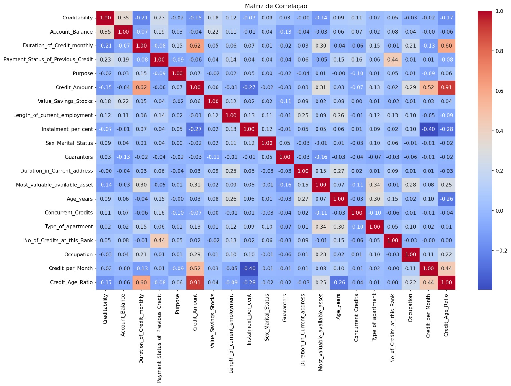

# Desenvolvimento de um Modelo Preditivo para Apoio à Decisão de Crédito com abordagem em *Machine Learning*

## Identificação da Equipa 
* **Grupo nº:** 5
* **Membros:** 
  * Iara Gomes - Nº 2023133177 
  * Rita Vinagreiro - Nº 2023136923 
  * Ana Silva - Nº 2023145191
 
 
 
## Organização do Repositório 
 
A estrutura deste projeto segue as boas práticas de Ciência de Dados e Engenharia de Software: 
 
* **`data/`**: Armazenamento de dados (dados brutos em `raw/` e processados em `processed/`). 
* **`docs/`**: Documentação técnica detalhada dividida por Milestones (M1, M2 e M3). 
* **`notebooks/`**: Jupyter Notebooks para experimentação, limpeza e modelação. 
* **`src/`**: Código-fonte modular (scripts `.py`) para funções reutilizáveis. 
* **`reports/`**: Relatórios finais, apresentações e exportação de figuras (`figures/`). 
* **`requirements.txt`**: Ficheiro de configuração com as bibliotecas necessárias. 
 
 
 
## 1. Iniciação (Milestone 1) 
### Contexto e Problema de Negócio 
Emprestar dinheiro implica sempre um risco: a possibilidade de o cliente não reembolsar o capital em dívida, total ou parcialmente. Este risco denomina-se risco de crédito e a sua gestão eficaz é determinante para a estabilidade financeira de qualquer banco. 

Neste contexto, o presente projeto tem como objetivo apoiar uma instituição financeira na decisão de aprovar ou recusar um empréstimo, prevendo a probabilidade de incumprimento de cada cliente com base em dados históricos. Para tal, recorre-se ao desenvolvimento de modelos automatizados de previsão de risco de crédito, assentes em técnicas de *Machine Learning*. 

A adoção destas abordagens permite tornar este processo mais eficiente, contribuindo para a redução de potenciais perdas financeiras e para a promoção de decisões mais informadas e consistentes.
 
 
### Objetivos do Projeto 
* **Objetivo 1:** Desenvolver um modelo preditivo capaz de apoiar a instituição financeira na decisão de aprovação ou recusa de crédito, treinado com 80% dos dados e avaliado num conjunto de teste independente, que atinja um F1-Score mínimo de 0.80 e uma AUC_ROC mínima de 0.80, até ao final do Milestone 3.
* **Objetivo 2:** Classificar os clientes em categorias de risco de incumprimento (baixo e alto risco), com base nas previsões do modelo desenvolvido, garantindo uma taxa de identificação de incumprimento (Recall) igual ou superior a 70%, até ao final do Milestone 3.

### Perguntas de Investigação

1. Quais são as características financeiras e demográficas mais comuns entre os clientes em incumprimento de crédito?
2. Existe relação entre o montante do crédito e a ocorrência de incumprimento?
3. De que forma a duração do crédito influencia a ocorrência de incumprimento?
4. Quais são as variáveis que mais contribuem para a previsão do incumprimento de crédito?
5. É possível classificar os clientes em categorias de risco de incumprimento (baixo e alto risco), com base nas probabilidades geradas pelo modelo preditivo?
 
### Fonte de Dados 

| **Dataset** | German Credit Data (Kaggle)|
|:---|:---|
| **Link** | https://www.kaggle.com/datasets/mpwolke/cusersmarildownloadsgermancsv/data |
| **Dimensão** | 1000 observações (linhas) e 21 variáveis (colunas)|
| **Variável Alvo**|Creditability (1 = Cumprimento, 0 =Incumprimento)|
| **Descrição** | O *dataset* contém informação financeira e demográfica de clientes, utilizada para avaliar o risco de crédito e prever a probabilidade de incumprimento. |

 
### Bibliotecas e ferramentas
O projeto vai ser desenvolvido em ambiente Jupyter Notebook para programar, recorrendo às bibliotecas NumPy; Pandas; Seaborn; Matplotlib e Scikit-learn.  
 
## 2. Exploração (Milestone 2) 
### Limpeza e Preparação 
Após a análise inicial do dataset, verificou-se que não existem valores em falta e que as variáveis já se encontram codificadas em formato numérico.

Durante a análise exploratória foram identificados discrepantes em algumas variáveis numéricas: *Duration_of_Credit_monthly*; *Credit_Amount*; *Age_Years*; *No_of_Credit_at_this_Bank*; *No_of_dependents*. No entanto, após análise do contexto dos dados, concluiu-se que estes valores correspondem a observações plausíveis no domínio do crédito, não representavando erros ou inconsistências, pelo que foram mantidos no dataset.

Foi ainda aplicado o StandarScaler às variáveis numéricas contínuas, de forma a garantir que todas apresentam a mesma escala, evitando enviesamentos no desempenho dos modelos.
 
### Principais Conclusões (EDA) 

**Figura 1 – Matriz de correlação entre as variáveis do dataset.**

A análise exploratória dos dados, suportada pela matriz de correlação apresentada na Figura 1, permitiu identificar relações relevantes entre as variáveis do dataset e o risco de crédito.

Destaca-se a variável *Account_Balance*, que apresenta a maior correlação com a variável alvo, sugerindo que clientes com níveis de saldo mais elevados tendem a apresentar menor probabilidade de incumprimento.

Adicionalmente, verifica-se que variáveis como *Duration_of_Credit_monthly* e *Credit_Amount* apresentam correlações negativas com a variável alvo, indicando que créditos de maior duração e montante estão associados a maior risco de crédito.

As variáveis derivadas criadas, nomeadamente *Credit_per_Month* e *Credit_Age_Ratio*, evidenciam também relações relevantes com outras variáveis do dataset, permitindo captar informação adicional sobre a intensidade do crédito e o peso relativo do empréstimo face à idade do cliente. Estes resultados sugerem que estas variáveis podem contribuir para melhorar a capacidade preditiva dos modelos.

Apesar das relações identificadas, observa-se que a maioria das correlações apresenta intensidade fraca a moderada, indicando que o risco de crédito não pode ser explicado por uma única variável.

* **Ponto-chave:** O risco de crédito resulta da combinação de múltiplos fatores financeiros e características do empréstimo, sendo necessária a utilização de modelos de classificação multivariados para capturar essas relações de forma eficaz.
 
 
 
## 3. Modelação (Milestone 3) 
### Abordagem Técnica 
* **Modelos:** [Ex: Random Forest e XGBoost] 
* **Métrica Principal:** [Ex: F1-Score ou RMSE] 
 
 
 
## 4. Finalização (Milestone 4) 
### Resposta ao Problema 
[Resumo da solução e como ela gera valor para o negócio.] 
 
### Recomendações de Inovação 
1. [Sugestão prática baseada nos resultados]

## 5. Referências bibliográficas
1. Prata, M. (2020). *Creditability - German Credit Data* [Dataset]. Kaggle. Consultado pela última vez a 18 de março de 2026, de https://www.kaggle.com/datasets/mpwolke/cusersmarildownloadsgermancsv/data
 
## Como Reproduzir este Projeto 
1. Clone o repositório: `git clone [url-do-repo]` 
2. Instale as dependências: `pip install -r requirements.txt` 
3. Execute os notebooks na pasta `notebooks/` seguindo a ordem numérica. 
 
 
**Instituição:** Coimbra Business School | ISCAC   
**Curso:** Licenciatura em Ciência de Dados para a Gestão   
**Unidade Curricular:** Projeto em Ciência de Dados   
**Professor Responsável:** Dora Melo (dmelo@iscac.pt)   
